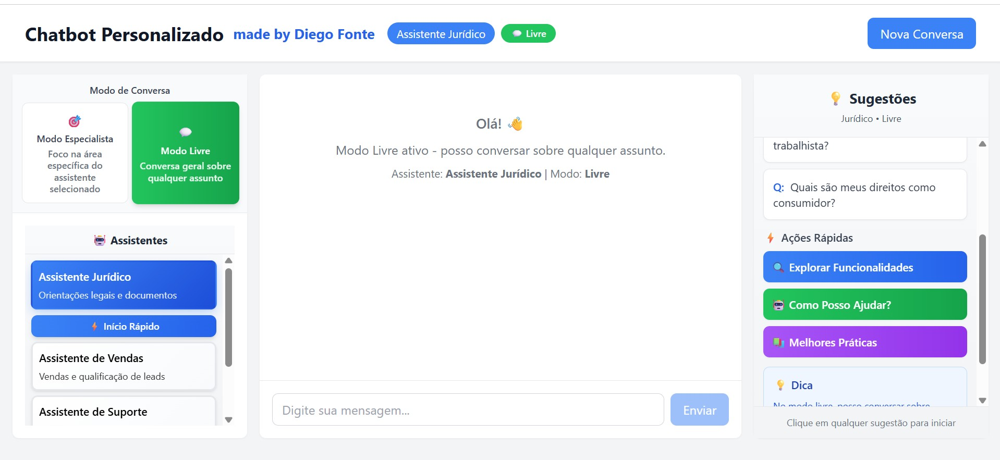
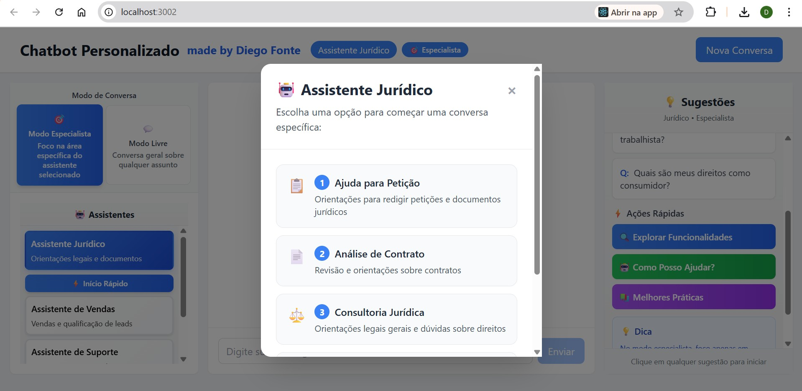
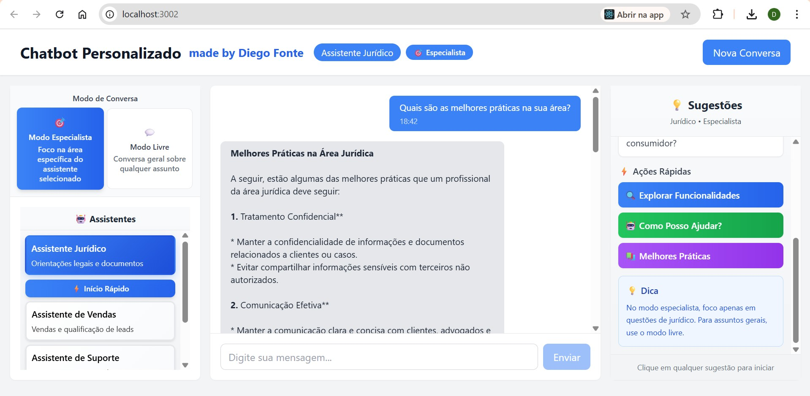
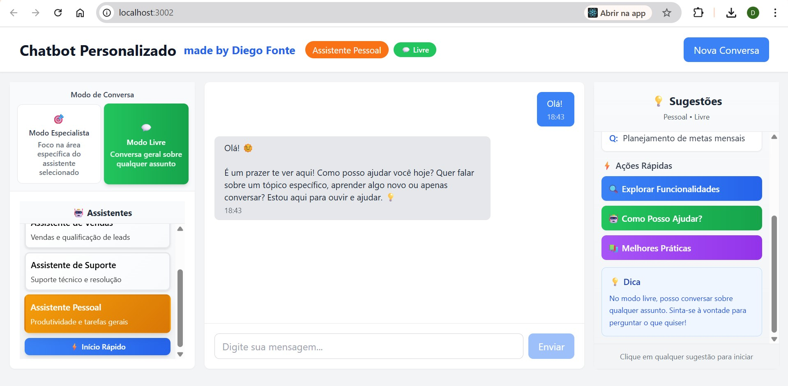
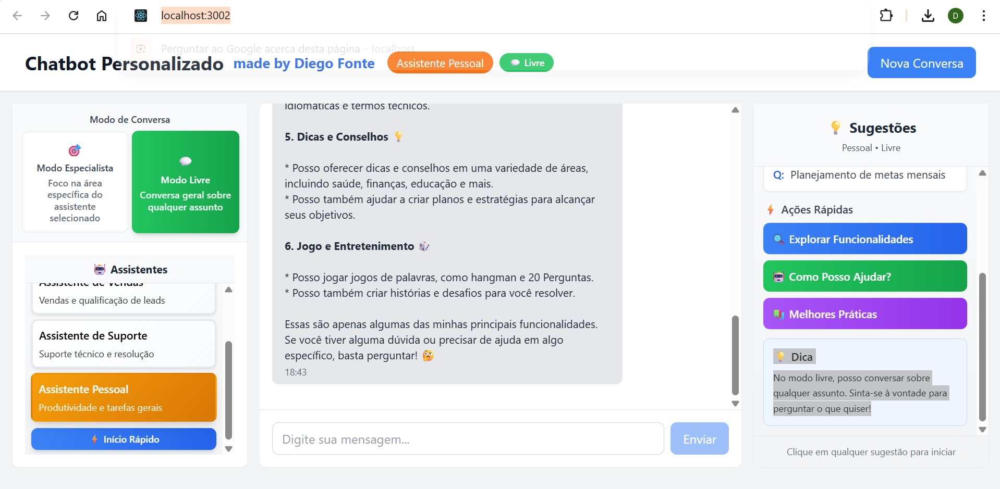

# 🤖 ChatBot Personalizado Diversos - DEMO (WhatsApp & Telegram Ready)

[](https://reactjs.org/)
[](https://nodejs.org/)
[](https://expressjs.com/)
[](https://groq.com/)
[](https://docker.com/)
[](https://sqlite.org/)
[](https://tailwindcss.com/)
[](https://opensource.org/licenses/MIT)

> **🚀 PROJETO DEMO** - Chatbot inteligente e personalizado com múltiplas personas especializadas, construído com React, Node.js e integração com Groq API. Totalmente dockerizado para fácil deploy e desenvolvimento. **Pronto para integrar com WhatsApp e Telegram**.

## ⚡ DEMO - Conceito Avançado

Este é um **projeto DEMO** que demonstra tecnologias avançadas de chatbots conversacionais com IA. O código é **100% personalizável** e pode ser adaptado para diversos tipos de negócios e casos de uso.

### 🎯 Por que este DEMO é Especial?

- **Múltiplas Personas**: Sistema único com assistentes especializados
- **Frontend Totalmente Editável**: Modifique cores, layout, textos, funcionalidades
- **Arquitetura Enterprise**: Docker, TypeScript, segurança, logs
- **Pronto para Produção**: WhatsApp, Telegram, API completa
- **Flexibilidade Total**: Adapte para qualquer nicho de negócio

## 📸 Screenshots

<div align="center">












</div>

## 👨‍💻 Autor

**Diego Fonte** - Desenvolvedor Full Stack | Consultor de Cyber Segurança e IA

- 🌐 Website: [www.diegofontedev.com.br](https://www.diegofontedev.com.br) | [English](https://www.diegofontedev.com.br/index-en.html) | [Español](https://www.diegofontedev.com.br/index-es.html)
- 🏢 Empresa: [www.zowti.com](https://www.zowti.com) | [English](https://www.zowti.com/en/index.html) | [Español](https://www.zowti.com/es/index.html)
- 📧 Email: contato@diegofontedev.com.br

## 🌟 Características

### 🎭 Personas Especializadas (Exemplos - Totalmente Personalizáveis)
- **👨‍⚖️ Assistente Jurídico**: Orientações legais básicas e geração de minutas
- **📈 Assistente de Vendas**: Qualificação de leads e estratégias comerciais  
- **🎧 Assistente de Suporte**: Atendimento ao cliente e resolução de problemas
- **👤 Assistente Pessoal**: Produtividade e tarefas diversas

### 🔧 Exemplos de Adaptação para Outros Negócios
- **🏥 Clínica Médica**: Assistente de agendamento + Suporte pós-consulta + FAQ médico
- **🏪 E-commerce**: Suporte vendas + Pós-venda + Recomendação produtos
- **🏢 Empresa**: RH + Suporte TI + Atendimento interno + FAQ corporativo
- **🎓 Educação**: Tutor virtual + Suporte estudantes + Orientação acadêmica
- **🏡 Imobiliária**: Consultor imóveis + Agendamento visitas + Suporte contratos

### 🚀 Funcionalidades Principais
- ⚡ Interface de chat em tempo real
- 🎨 Interface moderna e responsiva
- 💾 Histórico completo de conversas
- 🔒 Autenticação e segurança
- ⏱️ Rate limiting por IP
- 📱 Design responsivo para mobile
- 🛡️ Validação robusta de inputs
- 📊 Sistema de templates de respostas
- 🐳 **100% Dockerizado**
- 📱 **Integração WhatsApp e Telegram** (opcional)

### 🛠️ Stack Tecnológico
- **Frontend**: React 18 + TypeScript + Tailwind CSS
- **Backend**: Node.js + Express + SQLite
- **IA**: Groq API com llama-3.1-8b-instant
- **Segurança**: Helmet, CORS, Rate Limiting
- **Validação**: Express Validator
- **Deploy**: Docker + Docker Compose
- **Containerização**: Docker com multi-stage builds
- **Bots**: WhatsApp Web.js + Telegram Bot API (opcional)

## 🐳 Instalação com Docker (Recomendado)

### Pré-requisitos
- Docker e Docker Compose
- Chave da API Groq

### 1. Clone o Repositório
```bash
git clone https://github.com/Diego-Cruz-github/chatbot-personalizado-diversos.git
cd chatbot-personalizado-diversos
```

### 2. Configurar Variáveis de Ambiente
```bash
# Copie o arquivo de ambiente
cp backend/.env.example backend/.env

# Configure sua chave da API Groq no backend/.env:
GROQ_API_KEY=sua_chave_groq_aqui
GROQ_MODEL=llama-3.1-8b-instant
PORT=3001
FRONTEND_URL=http://localhost:3002
```

### 3. Executar com Docker
```bash
# Build e executar containers
docker-compose up --build

# Ou em background
docker-compose up -d
```

**Acesso:**
- Frontend: http://localhost:3002
- Backend API: http://localhost:3001

### 4. Comandos Docker Úteis
```bash
# Ver logs
docker-compose logs -f

# Parar containers
docker-compose down

# Rebuild completo
docker-compose down && docker-compose build --no-cache && docker-compose up
```

## 🔧 Instalação Local (Alternativa)

### Pré-requisitos
- Node.js 18+ 
- npm ou yarn
- Chave da API Groq

### 1. Configuração do Backend
```bash
cd backend
npm install

# Configure suas variáveis de ambiente no .env:
# GROQ_API_KEY=sua_chave_groq_aqui
# NODE_ENV=development
# PORT=3001
# FRONTEND_URL=http://localhost:3002
```

### 2. Configuração do Frontend
```bash
cd ../frontend
npm install

# Crie um arquivo .env para o frontend (opcional)
echo "REACT_APP_API_URL=http://localhost:3001/api" > .env
```

### 3. Executar em Desenvolvimento
```bash
# Terminal 1 - Backend
cd backend
npm run dev

# Terminal 2 - Frontend
cd frontend
npm start
```

## 📚 Documentação da API

### Endpoints Principais

#### POST /api/chat
Envia uma mensagem para o chatbot.

**Request:**
```json
{
  "message": "Olá, preciso de ajuda com um contrato",
  "persona": "legal",
  "mode": "expert",
  "conversationId": "uuid-opcional"
}
```

**Response:**
```json
{
  "response": "Olá! Sou seu assistente jurídico...",
  "conversationId": "550e8400-e29b-41d4-a716-446655440000",
  "messageId": "550e8400-e29b-41d4-a716-446655440001"
}
```

#### GET /api/conversations
Lista todas as conversas.

#### GET /api/conversations/:id
Obtém uma conversa específica com todas as mensagens.

#### DELETE /api/conversations/:id
Remove uma conversa e todas suas mensagens.

### Rate Limits
- **Geral**: 100 requests por 15 minutos por IP
- **Chat**: 10 mensagens por minuto por IP

## 🌐 Deploy

### Deploy com Docker (Produção)
```bash
# Build para produção
docker-compose -f docker-compose.prod.yml up --build -d

# Configure variáveis de ambiente:
# GROQ_API_KEY=sua_chave_groq
# NODE_ENV=production
# FRONTEND_URL=https://seu-dominio.com
```

### Deploy Tradicional
```bash
# Frontend (Vercel/Netlify)
cd frontend && npm run build

# Backend (Railway/Render)
# Configure as variáveis de ambiente no painel da plataforma
```

### Variáveis de Ambiente para Produção
```env
# Backend
GROQ_API_KEY=gsk-...
GROQ_MODEL=llama-3.1-8b-instant
NODE_ENV=production
PORT=3001
FRONTEND_URL=https://seu-app.vercel.app
JWT_SECRET=seu_jwt_secret_super_seguro
```

## 🎨 Frontend 100% Personalizável

### 🔧 Como Personalizar
```typescript
// frontend/src/config/personas.ts - Modifique personas
export const personas = {
  medico: {
    name: "Dr. Assistente",
    icon: "🏥",
    description: "Assistente médico para agendamentos",
    color: "blue"
  }
}

// frontend/src/App.tsx - Modifique cores e layout
const themeConfig = {
  primaryColor: '#3B82F6',  // Azul
  secondaryColor: '#EF4444', // Vermelho
  companyName: 'Sua Empresa'
}
```

### 🎯 Elementos Editáveis
- **Cores e Tema**: Tailwind CSS configurável
- **Textos e Labels**: Todos centralizados em arquivos config
- **Logos e Imagens**: Pasta public/ para assets
- **Layout**: Componentes React modulares
- **Funcionalidades**: Adicione/remova personas facilmente

## 🔐 Segurança

### Medidas Implementadas
- ✅ Rate limiting por IP
- ✅ Validação de entrada
- ✅ Helmet para headers de segurança
- ✅ CORS configurado
- ✅ Sanitização de dados
- ✅ Logs de segurança
- ✅ Docker security best practices

### Recomendações Adicionais
- Use HTTPS em produção
- Configure firewall adequadamente
- Monitore logs de acesso
- Mantenha dependências atualizadas

## 🧪 Testes

```bash
# Com Docker
docker-compose exec backend npm test
docker-compose exec frontend npm test

# Local
cd backend && npm test
cd frontend && npm test
```

## 📈 Monitoramento e Logs

O sistema inclui logging detalhado:
- Requests HTTP (Morgan)
- Erros de aplicação
- Interações com Groq API
- Rate limiting por IP
- Docker container logs

## 🤝 Contribuição

1. Fork o projeto
2. Crie uma branch para sua feature (`git checkout -b feature/AmazingFeature`)
3. Commit suas mudanças (`git commit -m 'Add some AmazingFeature'`)
4. Push para a branch (`git push origin feature/AmazingFeature`)
5. Abra um Pull Request

## 📝 Roadmap

- [ ] Autenticação completa com JWT
- [ ] Sistema de usuários
- [ ] Chat em tempo real com WebSockets
- [ ] Exportação de conversas (PDF/JSON)
- [ ] Analytics e métricas
- [ ] Integração com mais provedores de IA
- [ ] Sistema de plugins
- [ ] API webhooks
- [ ] Kubernetes deployment
- [ ] CI/CD pipeline

## ❓ FAQ

**Q: Como obter uma chave da Groq?**
A: Acesse https://console.groq.com/keys e crie uma nova chave API.

**Q: Posso usar outros modelos Groq?**
A: Sim! Configure a variável GROQ_MODEL no .env com outros modelos disponíveis como llama-3.1-70b-versatile.

**Q: Como personalizar as personas?**
A: Edite o arquivo `frontend/src/config/personas.ts` e `backend/src/services/openai.js`.

**Q: O Docker é obrigatório?**
A: Não, mas é altamente recomendado para desenvolvimento e deploy simplificados.

**Q: Como ativar WhatsApp e Telegram?**
A: Veja a documentação completa em [INTEGRATIONS.md](INTEGRATIONS.md).

## 🤖 Integrações de Bots

### 📱 WhatsApp Bot
- ✅ **Resposta automática** a mensagens privadas
- ✅ **QR Code** para conexão rápida
- ✅ **Todas as personas** disponíveis
- ✅ **Session persistente**

```bash
# Ativar WhatsApp
ENABLE_WHATSAPP=true

# Instalar dependências
npm install whatsapp-web.js qrcode-terminal
```

### 🤖 Telegram Bot  
- ✅ **Comandos interativos** (/start, /help, /legal, etc.)
- ✅ **Teclado inline** para personas
- ✅ **Polling automático**
- ✅ **Suporte a Markdown**

```bash
# Ativar Telegram
ENABLE_TELEGRAM=true
TELEGRAM_BOT_TOKEN=seu_token_do_botfather

# Instalar dependências
npm install node-telegram-bot-api
```

### 🚀 Configuração Rápida
1. Configure as variáveis no `.env`
2. Instale dependências opcionais
3. Reinicie o servidor: `docker-compose restart`
4. Para WhatsApp: escaneie QR code
5. Para Telegram: converse com [@BotFather](https://t.me/botfather)

📖 **Documentação completa**: [INTEGRATIONS.md](INTEGRATIONS.md)

## 📞 Suporte

- 🐛 Issues: [GitHub Issues](https://github.com/Diego-Cruz-github/chatbot-personalizado-diversos/issues)
- 💬 Discussões: [GitHub Discussions](https://github.com/Diego-Cruz-github/chatbot-personalizado-diversos/discussions)

## 📄 Licença

Este projeto está licenciado sob a Licença MIT - veja o arquivo [LICENSE](LICENSE) para detalhes.

---

## 🔗 Projetos Relacionados

Confira outros projetos DEMO similares:
- 🚀 **[Gerador Inteligente de Orçamentos](https://github.com/Diego-Cruz-github/Gerador-Inteligente-de-Orcamentos)** - Sistema conversacional para orçamentos profissionais com BI integrado

## 👨‍💻 Autor

**Diego Fonte** - Desenvolvedor Full Stack | Consultor de Cyber Segurança e IA

- 🌐 Website: [www.diegofontedev.com.br](https://www.diegofontedev.com.br) | [English](https://www.diegofontedev.com.br/index-en.html) | [Español](https://www.diegofontedev.com.br/index-es.html)
- 🏢 Empresa: [www.zowti.com](https://www.zowti.com) | [English](https://www.zowti.com/en/index.html) | [Español](https://www.zowti.com/es/index.html)
- 📧 Email: contato@diegofontedev.com.br

## 📄 Licença

Este projeto está licenciado sob a Licença MIT - veja o arquivo [LICENSE](LICENSE) para detalhes.

---

### 🎯 Projeto DEMO Profissional

Este é um **projeto de demonstração profissional** que showcases tecnologias modernas de desenvolvimento e IA aplicadas a chatbots conversacionais.

**Ready for Production** | **Multi-Persona AI** | **Enterprise Security** | **Docker Ready** | **100% Customizable**